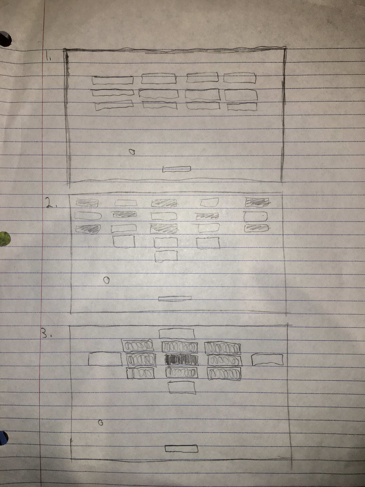
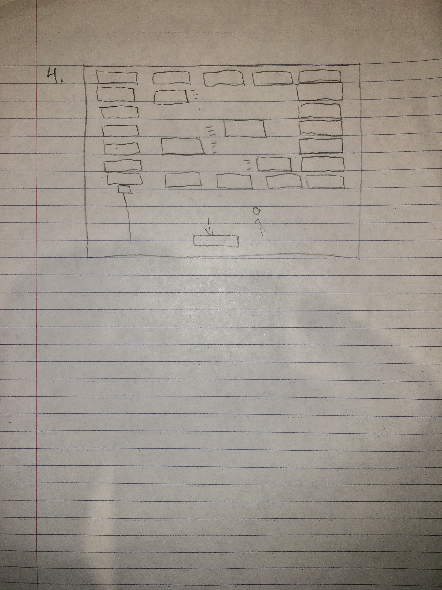

# Game Plan
## NAMEs

Connor Penny
John Taylor

### Breakout Variant

We thought the variant of Breakout that included pinball-style elements in the scene with the bricks was interesting.
These elements could be added as their own class with interesting attributes that make the game more interesting. This
variation was also collaborative, and multiple players worked together to break bricks from either side of the window.

### General Level Descriptions

Level 1: Easy

This level will just be the most basic model of Breakout to introduce the user to the game. It will be a grid of 
bricks (all of the same type). There will be a gap between the back wall and the bricks to incentivize the user
to break through a full column of bricks to reach the back wall and get the ball stuck so that it breaks a large 
amount of bricks.

Level 2: Brick Pyramid

This level will be a grid of bricks that taper into a pyramid in the last few layers of bricks that get closer
 to the user paddle. Within the grid of bricks, some will take multiple collisions to break.
 
Level 3: Brick Diamond

This level will be a diamond of bricks, where the bricks require progressively more hits to break as you get closer
to the center of the diamond.

Level 4: Moving Bricks Arena

This level will be a rectangle of non-moving bricks, and within this square will be laterally moving bricks.

Sketches of each level are provided here in the link below. Number and size of bricks in the sketches may not be
exactly what is designed in the program. These sketches are just for general configuration visualization.





### Bricks Ideas
We plan on having 5 different types of bricks:

- ```Easy Brick```: This brick is light colored, and requires only one hit to be broken. 

- ```Medium Brick```: This brick is darker than the easy brick, but not as dark as the hard brick.
This brick requires 2 hits to be broken, and will change to a lighter color after the first hit.

- ```Hard Brick```: This brick is the darkest color and requires 3 hits to be broken. Like the medium
brick, this brick will change color to become lighter after the first, and again after the second hit.

- ```Moving Brick```: This brick is one that will be an easy brick that moves left and right on the screen.
It is utilized on level 4, and it will move within a specified range.

- ```Power-Up Brick```: This brick will require 2 hits, and once it is broken it will drop a 
random power up to help the player.


### Power Up Ideas

Wider Paddle: When this power-up collides with the user paddle, the user paddle increases in size (1.5x?)

Slower Ball: When this power-up collides with the user paddle, the ball decreases in speed (0.75x?)

### Cheat Key Ideas
- ```Thanos Cheat```: If the player presses a specific key sequence, half of the bricks
remaining on the screen will be erased.

- ```Level Cheat```: Each level has a specific key sequence associated with it to
take the player directly to that level.

### Something Extra

Our idea for a substantial addition is to make two-player (multi-paddle) Breakout. In this version, there would be
two paddles (and two balls?) on either end of the window, and they would be controlled by different keys (ASDW and
arrow keys). We think this is a substantial addition to the game because it introduces a collaborative element to
the game and changes game-play strategy.

### Possible Classes
We believe there will be 4 primary classes:
- ```Brick Superclass```: Contains a "death" method that deletes the brick if it has been collided
with.
- ```Power-Up Superclass```: Contains a "show" method that shows the power-up on the
screen once a power-up brick has been hit.
- ```Paddle Class```: Contains a "move" method that allows it to move left and right based
on the user key input. (May be split into two separate methods to control the specific directions).
- ```Ball Class```: Contains a "bounce" method to create a bounce effect once the 
ball collides with an object like a wall or a brick.

